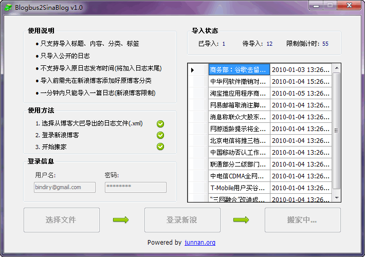

## 博客大巴到新浪博客搬家工具

> 此工具已停止更新

本工具使用C#，在Visual Studio 2010下编写。

1. 只支持导入日志标题、内容、分类、标签，原日志发布时间会加到日志内容的结尾。
2. 会过滤隐藏日志导入公开的日志。
3. 每导入一篇日志都需要等待1分钟（这是新浪博客的限制）。
4. 导入前需要在新浪博客建好原博客分类。
5. 导入前需要先到博客大巴的博客设置中把日志的xml文件导出。

### 更新：

**2010.1.28**

不小心发现新浪博客在用户的博客feed中偷偷加入了这样一句话：“想保证博客的稳定与信息安全吗？快来，一键备份博客大巴文章到新浪博客！请[点击进入](http://control.blog.sina.com.cn/admin/blogmove/blogmove.php?bsptype=blogbus)~”。
显然新浪博客这事做得不光彩，推荐用官方的搬家工具。

**2011.7.9**

经网友nikivv的反馈，新浪博客官方的搬家工具失效，所以针对博客大巴导出问题和新浪博客登录页面所做的调整。今晚对搬家工具进行了修正，更新1.1版本。
